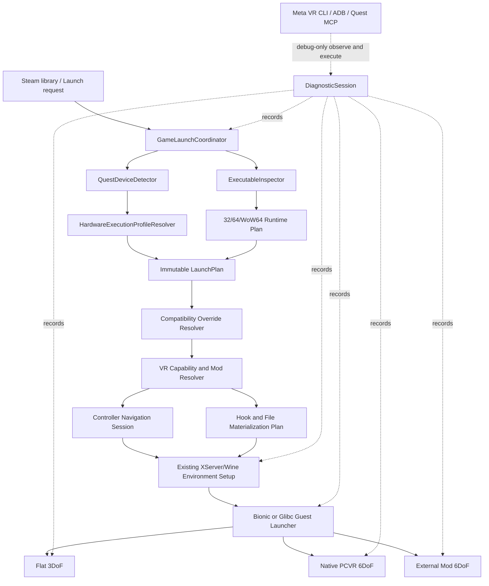

# GameNativeXR Architecture and Implementation Plan

## Document status

- **Plan baseline:** `Dev-Update` at commit `6cde5d4b99ad1ddf3aedcaaf9eb6982c4261ffaa`
- **Plan date:** 2026-08-02
- **Scope of this document:** architecture and implementation sequencing only
- **Implementation status:** no code or scaffolding from this plan has been started
- **Primary target:** a standalone Meta Quest client that can launch supported 32-bit and 64-bit Windows games from a user's Steam library

This plan is based on Rider inspection of the current `Dev-Update` worktree. Proposed classes and packages are explicitly marked as planned additions; they do not exist in the baseline unless listed in the current-state inventory.

## 1. Objective and definition of success

GameNativeXR will provide one controller-operable launch client for Steam games on Meta Quest 2 and Meta Quest 3. The client will:

1. resolve and validate an installed Steam title;
2. select a Quest-specific execution environment for the headset that is actually running the client;
3. prepare a compatible 32-bit, 64-bit, or mixed WoW64 Wine/Proton environment;
4. make every pre-game screen usable with VR controllers, including text-entry screens;
5. start and monitor the game through one observable launch pipeline;
6. present flat games with a guest-facing 3DoF fallback;
7. support full 6DoF and passthrough for compatible native PCVR paths;
8. discover and safely activate game-specific external VR mods through a versioned hook contract; and
9. produce enough structured diagnostics to explain each launch decision and failure.

“Any Steam library game” is the architectural coverage goal, not a claim that every Windows title will be compatible. Unsupported anti-cheat, DRM, kernel drivers, CPU instructions, graphics APIs, or launcher behavior must produce a classified failure rather than an unexplained black screen. This project runs games locally on the headset; PC streaming is outside this plan.

## 2. Scope boundaries

### Included

- Windows guest executables that are 32-bit, 64-bit, or mixed through WoW64.
- Quest 2 and Quest 3 runtime identification.
- GameNative container settings needed to execute on each headset: Wine/Proton container, CPU translation layer, graphics driver, DirectX translation layer, and their versions.
- Steam authentication, launcher, setup, and other pre-game interaction through VR controllers.
- High-verbosity Java/Kotlin, native XR, Wine/Proton, translator, X server, Steam, mod-hook, and process-lifecycle diagnostics.
- Flat-screen 3DoF presentation, native PCVR 6DoF, passthrough, and external VR-mod 6DoF paths.
- Debug-only use of Meta VR CLI, ADB, and Meta XR Operator/Quest MCP for device observation, log retrieval, and test execution.

### Excluded

- Quest-specific performance tuning. Hardware profiles in this plan do not set refresh rate, render resolution, foveation, CPU/GPU performance levels, upscaling, or frame-generation policy.
- A blanket promise to bypass DRM, anti-cheat, or online integrity controls.
- Automatic modification of unrecognized game binaries.
- Shipping Meta XR Operator or agent-control tooling in production builds.
- Quest 3 profile promotion without execution evidence from physical Quest 3 hardware.
- Replacing the current dependency baseline as part of these architectural phases.

## 3. Current baseline found through Rider

### 3.1 Existing components to preserve and extend

| Area | Current source of truth | Baseline behavior | Architectural implication |
| --- | --- | --- | --- |
| Application startup | `app/src/main/java/app/gamenative/PluviaApp.kt` | Loads system libraries, then plants Timber and installs `CrashHandler` | Diagnostic initialization must move to the earliest safe point and work in both the main and `:vr_process` processes. |
| Hardware facts | `app/src/main/java/app/gamenative/utils/HardwareUtils.kt` and `com/winlator/core/GPUInformation` | Reads `Build` values and GPU renderer/family information | Reuse these probes, but add an explicit Quest device classifier instead of treating GPU family as the device identity. |
| Default environment selection | `app/src/main/java/app/gamenative/utils/ContainerUtils.kt` | Mutates `DefaultVersion` according to GPU family | Replace launch-time reliance on mutable global defaults with an immutable, logged profile-resolution result. |
| Compatibility overrides | `app/src/main/java/app/gamenative/utils/BestConfigService.kt` | Applies exact-game/GPU matches and protects graphics settings on weak matches | Preserve this distinction and define deterministic precedence between hardware, compatibility, and user settings. |
| Container model | `com/winlator/container/Container.kt` and `ContainerData.kt` | Already stores Wine/Proton, Bionic/Glibc, FEXCore, Box86/64, WoW64, graphics driver, DX wrapper, and XR input settings | Hardware profiles can map into existing execution fields; a second unrelated container model is unnecessary. |
| Launch orchestration | `app/src/main/java/app/gamenative/ui/screen/xserver/XServerScreen.kt` | Resolves the command, prepares Wine, graphics and audio, creates environment components, configures Steam, and starts the guest | Extract a launch coordinator incrementally around this path. Do not replace the working environment setup in one rewrite. |
| Guest launchers | `BionicProgramLauncherComponent`, `GlibcProgramLauncherComponent`, and `GuestProgramLauncherComponent` | Bionic can use FEXCore/Box64; Glibc uses Box64/Box86; launch output is exposed through `ProcessHelper` callbacks | Keep these as execution backends behind one planned launcher interface and log backend selection explicitly. |
| Process output | `com/winlator/core/ProcessHelper.java` | Can drain stdout/stderr when callbacks are registered; `XServerScreen` clears and re-adds global callbacks | Replace destructive global callback ownership with a multi-subscriber process-output bus tied to a launch ID. |
| XR host activity | `com/winlator/xr/XrActivity.java` | Loads prebuilt `libxr.so`, receives poses/buttons, controls passthrough/VR flags, and starts a versioned `XrAPI` bridge | Preserve the Java contract, but obtain the matching native source and reproducible build before changing native tracking behavior. |
| XR rendering | `com/winlator/xr/XrRenderer.java` | Renders through the OpenGL X-server view into native XR framebuffers and can enable passthrough via native state | Keep this path until parity tests justify any renderer change. Renderer modernization is not part of this plan. |
| XR bridge | `com/winlator/xr/api/XrAPI.java` and `XrVersion01`–`04` | Uses a version file plus local UDP ports to exchange HMD/controller state and guest inputs | Evolve this as a negotiated protocol; do not silently change the existing `0.1`–`0.4` wire formats. |
| XR controller input | `com/winlator/xr/XrController.java` | Maps controller motion to the X-server pointer, trigger/grip to mouse buttons, buttons to keys, and thumbsticks to dialog navigation | Build the unified pre-game router around this transport instead of creating a disconnected input stack. |
| XR keyboard | `com/winlator/xr/XrKeyboard.java` | Opens Android IME on a hidden `EditText` and converts text to X-server key events | Retain as a compatibility sink, but add a visible, controller-operable XR keyboard and a guest text-focus contract. |
| XR dialogs | `com/winlator/xr/ui/XrContentDialog.java` | Renders Android dialog content into an X-server drawable and accepts D-pad/Enter events | Reuse as the first overlay surface for controller navigation and keyboard UI. |
| General mod model | `app/gamenative/data/ModInstall.kt`, `ModProfileManager.kt`, and `ModMaterializer.kt` | Supports active per-game profiles, safe target roots, symlink/copy/overwrite-copy placement, hashes, backups, restoration, and conflicts | Reuse it for VR-mod file materialization. Add VR compatibility and hook metadata rather than duplicating file deployment. |
| Existing XR mod helpers | `com/winlator/xr/ModdingUtils.java` | Installs TrackIR and ReShade files before environment launch | Replace this special-case launch integration with a generic hook-plan stage while preserving these behaviors as adapters. |
| Crash handling | `app/gamenative/CrashHandler.kt` | Saves one Java crash report with 256 process-local logcat lines | Expand to rotating launch sessions, native/process exits, and Android exit reasons while retaining a human-readable crash summary. |
| Quest packaging | `app/build.gradle.kts` | `modernXr` is an arm64-v8a Android build; `legacyXr` also packages armeabi-v7a | Treat 32/64-bit support as Windows guest support. The modern Quest APK itself remains arm64-v8a. |

### 3.2 Important baseline constraints

1. `XServerScreen.kt` currently owns most launch sequencing. Architectural extraction must be phased and behavior-preserving.
2. `libxr.so` and `libopenxr_loader.so` are tracked prebuilt binaries under `app/src/main/jniLibs/arm64-v8a`. Matching `libxr.so` source is not present in this worktree.
3. The Java XR interface already exposes HMD and controller position/quaternion data, passthrough control, frame lifecycle, and VR mode control. This proves the Java-side contract exists, but not that every native PCVR runtime function is implemented.
4. No tracked Meta XR Operator integration or operator-specific source set exists at this baseline. Old ignored build artifacts are not source of truth.
5. The current external VR-mod reference uses a launcher executable, an injected DLL, D3D11 hooks, MinHook, and a Windows OpenXR runtime. That pattern should be represented as one manifest-selected hook strategy, not hard-coded into the client.

## 4. Target architecture



### 4.1 Planned architectural boundaries

The exact package names below are planned additions under existing source roots.

- **`GameLaunchCoordinator`** — owns the launch state machine and produces one terminal success/failure result.
- **`LaunchPlanResolver`** — combines executable facts, device profile, compatibility profile, user overrides, Steam mode, and VR capability into one immutable plan.
- **`ExecutableInspector`** — reads PE headers and records x86/x64 identity, hashes, imported VR APIs, and selected executable path without executing it.
- **`QuestDeviceDetector`** — converts observed `Build`, SoC, GPU, ABI, and Android facts into `QUEST_2`, `QUEST_3`, or `UNKNOWN_META` with evidence.
- **`HardwareExecutionProfileResolver`** — maps the detected headset to existing `ContainerData` execution fields.
- **`PreGameInputRouter`** — routes XR controller actions to Android overlays, X-server pointer/keyboard, or game input according to launch state.
- **`XrKeyboardOverlay`** — visible controller-operable keyboard surface with text and special keys.
- **`DiagnosticSession`** — process-safe structured log session, redaction, rotation, and export.
- **`TrackingModeResolver`** — selects `FLAT_3DOF`, `NATIVE_OPENXR_6DOF`, or `MODDED_6DOF` and rejects ambiguous combinations.
- **`VrModResolver`** — parses manifests, matches exact game/executable facts, and creates a hook plan.
- **`VrHookPlanExecutor`** — performs reversible pre-launch placement and environment changes, then monitors the mod handshake.
- **`GuestVrRuntimeAdapter`** — abstraction for Windows OpenXR and OpenVR-via-OpenComposite runtime bridging.
- **`XrHostBridge`** — versioned Java/native host endpoint for tracking, actions, swapchain/frame submission, passthrough state, and health events.

These components should be introduced behind interfaces and called from the current `XServerScreen` flow. Existing launch backends remain responsible for actual Bionic/Glibc process startup.

## 5. Unified launch contract

### 5.1 Immutable launch request

A launch request must identify:

- Steam app ID and selected launch option;
- resolved install root and executable path;
- requested mode: automatic, flat, native VR, or a selected external VR mod;
- offline/online request;
- active GameNative container and active mod profile; and
- whether the request is a normal launch or a diagnostic launch.

No phase may silently substitute an unrelated executable. If Steam metadata, the saved container path, and filesystem evidence disagree, resolution must fail with all candidate paths logged and a controller-operable repair choice displayed.

### 5.2 Executable identity

Before Wine/Proton starts, `ExecutableInspector` will record:

- canonical path relative to the game root;
- file size, modification time, and SHA-256;
- PE machine type (`x86` or `x64`); 
- whether the file is a launcher or the final configured game executable;
- imported graphics/VR libraries relevant to adapter selection; and
- whether an external mod manifest permits this exact hash or declares a controlled compatible range.

The inspector must be read-only. Child processes may change architecture after launch, so the selected container must remain WoW64-capable unless a game profile has evidence that a single-architecture environment is required.

### 5.3 Launch state machine

The coordinator will use explicit states rather than nested callbacks:

1. `REQUEST_RECEIVED`
2. `INSTALL_RESOLVING`
3. `EXECUTABLE_INSPECTING`
4. `DEVICE_DETECTING`
5. `HARDWARE_PROFILE_RESOLVING`
6. `COMPATIBILITY_RESOLVING`
7. `VR_CAPABILITY_RESOLVING`
8. `RUNTIME_VALIDATING`
9. `MOD_PLAN_VALIDATING`
10. `FILES_MATERIALIZING`
11. `STEAM_PREPARING`
12. `CONTAINER_PREPARING`
13. `ENVIRONMENT_STARTING`
14. `GUEST_PROCESS_STARTING`
15. `WINDOW_OR_XR_HANDSHAKE_WAITING`
16. `RUNNING`
17. `STOPPING`
18. `CLEANUP`
19. `COMPLETED` or `FAILED`

Every transition emits a structured event containing duration, decision inputs, result, and failure class. Cancellation and activity recreation must not create a second coordinator for the same launch ID.

### 5.4 Deterministic setting precedence

Settings will be resolved in this order, with every changed field recording its source:

1. versioned GameNative execution baseline;
2. detected Quest hardware execution profile;
3. exact executable/game compatibility profile;
4. active external VR-mod requirements;
5. explicit per-game user override.

A weak/fallback recommendation from `BestConfigService` must not replace hardware-critical graphics settings. An exact game or GPU match may do so. A mod requirement may reject a conflicting user override, but must show the conflict and require a deliberate choice; it must not silently rewrite persistent settings.

### 5.5 Failure taxonomy

At minimum, failures must be classified as:

- install or executable not found;
- unsupported or unknown executable architecture;
- missing translation component;
- incompatible hardware profile;
- missing graphics driver or DX translation component;
- Steam authentication/client failure;
- container preparation failure;
- guest process start failure;
- guest process exited before first window;
- first window appeared but stopped responding;
- native XR host initialization failure;
- VR runtime handshake timeout or protocol mismatch;
- mod hash/manifest mismatch;
- hook placement or rollback failure;
- Java exception, native crash, guest crash, or Android process death.

## 6. Pillar 1 — Quest 2 and Quest 3 hardware execution profiles

### 6.1 Detection mechanism

`QuestDeviceDetector` will collect a `QuestDeviceDescriptor` once per process:

- `Build.MANUFACTURER`, `BRAND`, `MODEL`, `DEVICE`, `PRODUCT`, and `HARDWARE`;
- `Build.SOC_MANUFACTURER` and `SOC_MODEL` where available;
- OpenGL renderer/vendor through the existing hardware/GPU utilities;
- Android-supported ABIs;
- Android version and security patch; and
- whether the current XR runtime resolves to `MetaQuest`.

Classification rules:

1. Require Meta/Oculus manufacturer/runtime evidence before selecting a Quest profile.
2. Match a checked-in set of model/product/SoC/GPU signatures captured from physical devices.
3. Require a non-conflicting GPU family: Quest 2 is expected to report an Adreno 6xx-class GPU, while Quest 3 is expected to report an Adreno 7xx-class GPU. Actual strings must be captured and committed as test fixtures before a rule is promoted.
4. If identifiers are missing or conflict, return `UNKNOWN_META`; never infer Quest 3 merely because the device is newer.
5. Log the raw descriptor, matched rule ID, confidence, and rejected rules without logging a device serial or user identifier.

Quest 2 evidence can be captured first. Quest 3 remains an unpromoted profile until a physical Quest 3 or a validated device report is available; Meta XR Simulator can verify control flow but cannot certify a physical-device driver profile.

### 6.2 Profile structure

Use versioned profile assets mapped only to existing environment-execution fields in `ContainerData`:

- profile ID and schema version;
- accepted detector rule IDs;
- `containerVariant`;
- `wineVersion`;
- `wow64Mode`;
- `emulator`;
- FEXCore version and correctness-related modes/preset;
- Box86/Box64 versions and correctness-related presets for fallback paths;
- `graphicsDriver`, `graphicsDriverVersion`, and `graphicsDriverConfig`;
- `dxwrapper` and `dxwrapperConfig` including selected DXVK/VKD3D versions; and
- required packaged component IDs and hashes.

Hardware profiles must not contain screen resolution, refresh rate, XR CPU/GPU level, foveation, upscaling, frame generation, frame caps, or other performance policy.

### 6.3 Initial candidates inherited from current behavior

These are starting candidates to be encoded and tested, not automatically declared final:

| Field | Quest 2 candidate | Quest 3 candidate | Basis |
| --- | --- | --- | --- |
| Container | Bionic | Bionic | Current Turnip-capable default path |
| Wine/Proton | `proton-10.0-arm64ec-2` | `proton-10.0-arm64ec-2` | Current `ContainerUtils` default |
| WoW64 | enabled | enabled | Required for mixed 32/64 Steam titles |
| Primary x86 translator | FEXCore `2605` | FEXCore `2605` | Current dependency baseline and `Container.DEFAULT_EMULATOR` |
| Fallback translator | Box64 `0.4.2`; Box86 `0.3.2` only where the selected Glibc path requires it | Same, subject to Quest 3 validation | Current `DefaultVersion` values |
| Graphics wrapper | `Wrapper` with `Turnip v26.2.0 R4` | `Wrapper` with `Turnip v26.2.0 R4` | Current Turnip-capable path; package presence must be verified |
| DXVK | `1.11.1-sarek` | `2.4.1-gplasync` | Current Adreno 6xx override versus other Turnip-capable GPUs |
| VKD3D | `2.14.1` | `2.14.1` | Current baseline default |

If qualification contradicts a candidate, update the profile evidence and version rather than adding hidden conditionals in `XServerScreen`.

### 6.4 Application behavior

- Apply the hardware profile when a container is created and at launch-plan resolution.
- Persist the selected profile ID, profile schema version, and detector rule ID in container extra data for diagnostics.
- Do not overwrite an explicit per-game user choice merely because the app version changed.
- Re-resolve when the app moves to another headset, when a profile schema changes, or when a required packaged component is missing.
- Show the resolved headset and execution stack in a read-only “Launch details” panel accessible with VR controllers.

### 6.5 Implementation tasks

1. Capture and redact a Quest 2 device descriptor using the diagnostic pipeline.
2. Add test fixtures for confirmed Quest 2 signatures and conflicting/unknown devices.
3. Define the profile schema and parser with unknown-field rejection for hardware-critical keys.
4. Build a pure profile resolver that returns an immutable field-by-field decision report.
5. Adapt `ContainerUtils.setContainerDefaults` to call the resolver instead of mutating shared `DefaultVersion` state during unrelated launches.
6. Feed the resolved values into the existing `ContainerData`/`Container` mapping.
7. Integrate exact-match `BestConfigService` overrides with the documented precedence.
8. Validate all profile component names against packaged resources before Wine starts.
9. Repeat descriptor capture, fixture creation, and component qualification on physical Quest 3 before promoting that profile.

### 6.6 Acceptance gates

- The same captured descriptor always resolves to the same profile and decision report.
- Unknown/conflicting Meta hardware never resolves to Quest 2 or Quest 3 silently.
- Quest 2 launches both a 32-bit test executable and a 64-bit test executable through the selected Bionic/WoW64 stack.
- Quest 3 must pass the same tests on physical hardware before its profile is marked supported.
- No hardware profile test changes performance-policy fields.

## 7. Pillar 2 — unified VR controller navigation before gameplay

### 7.1 Required interaction domains

The controller-only path must cover:

- GameNative library and dialogs;
- Steam sign-in and Steam Guard prompts;
- Wine desktop, launchers, setup programs, and redistributable prompts;
- browser-style account dialogs rendered inside the guest;
- file-selection or error dialogs that appear before the game window;
- manual keyboard invocation when automatic text-focus detection is unavailable; and
- transition into normal game controls without a stuck mouse button or key.

### 7.2 One input router with explicit modes

`PreGameInputRouter` will consume the pose/button arrays already obtained by `XrActivity` and select exactly one target mode:

- `ANDROID_OVERLAY` — GameNative/XR dialogs and keyboard;
- `GUEST_POINTER` — X-server absolute pointer and mouse buttons;
- `GUEST_TEXT` — X-server keyboard input to a focused guest field;
- `GUEST_NAVIGATION` — Enter, Tab, Shift+Tab, Escape, arrows, and scrolling;
- `GAME_INPUT` — existing mapped game controller/keyboard behavior; or
- `SYSTEM_MENU` — GameNativeXR quick menu, always recoverable.

Transitions must release held pointer buttons and keys before changing target. Input routing decisions and mode changes are logged, while entered text and key contents in password mode are never logged.

### 7.3 Pointer design

The current delta-position mouse mapping in `XrController.updateMouseAxes` remains the transport fallback. The planned pre-game pointer adds:

1. controller-ray/virtual-screen plane intersection for stable absolute coordinates;
2. clamping to the current X-server surface;
3. a visible reticle or cursor rendered by `XrRenderer` even when the guest hides its cursor;
4. trigger press/release as left click;
5. configurable secondary action as right click;
6. thumbstick vertical motion as scroll;
7. a controller action for Back/Escape; and
8. a recenter action that cannot be confused with a guest click.

The pointer must work with either controller independently. Right-controller-only operation is an explicit acceptance case.

### 7.4 Text-focus and keyboard design

The existing hidden-`EditText` `XrKeyboard` cannot by itself guarantee that the user can see or operate a keyboard. Add two cooperating pieces:

- **Guest text-focus signal:** extend the Wine/X-server integration to report when a text-capable guest control receives and loses focus. The implementation must be based on observed Wine/X11 focus/input events; if a control cannot be identified reliably, report `UNKNOWN` rather than repeatedly opening the keyboard.
- **Visible XR keyboard:** implement a controller-operable `XrKeyboardOverlay`, initially hosted through `XrContentDialog`, which sends events to the existing X-server keyboard sink.

Keyboard requirements:

- normal characters plus Shift/Caps state;
- Enter, Tab, Shift+Tab, Escape, Backspace, Delete, arrows, Home, End, and Space;
- password mode with masked overlay text;
- explicit Done and Close actions;
- no storage, analytics, or diagnostics of typed content;
- automatic opening for a confirmed guest text field;
- manual opening from the XR menu as a reliable fallback; and
- focus restoration to the guest window after closing.

Android IME through `XrKeyboard` remains a compatibility option, but controller-only completion must not depend on being able to touch the system keyboard.

### 7.5 Steam and launcher flow

- Use the same X-server pointer and keyboard path for Steam, web login, third-party launchers, and game setup windows.
- Do not add launcher-specific fake click coordinates.
- Track the active/top-level window using the existing X-server window-manager callbacks in `XServerScreen`.
- Route controller input to the most recently focused mapped guest window.
- Keep the XR quick menu available while a launcher is active.
- When the final game window is identified, transition from pre-game navigation to the configured game input profile and release all pre-game input state.

### 7.6 Implementation tasks

1. Add input-router state and pure button-transition tests around existing `XrController` data.
2. Add absolute ray-to-screen mapping and a visible pointer without changing gameplay tracking.
3. Make `XrContentDialog` focus navigation deterministic for every actionable item.
4. Implement the visible XR keyboard and special-key event generation.
5. Investigate and implement the narrowest guest text-focus signal supported by the current Wine/X-server path.
6. Connect confirmed text focus to auto-open, with debounce and password-safe diagnostics.
7. Define right-only and left-only controller layouts.
8. Add a final input-state reset on every mode transition, failure, pause, and process exit.
9. Exercise Steam sign-in, a generic launcher, and a setup prompt using only a VR controller.

### 7.7 Acceptance gates

- A user can start at the GameNative library and reach a game's first gameplay/menu screen without a physical keyboard, mouse, touch input, or ADB input injection.
- Username, password, TOTP, Enter, Tab, and Back work in guest authentication screens.
- Cursor location is visible and repeatable on the virtual screen.
- Right-controller-only and left-controller-only navigation each complete the test flow.
- No credentials or typed text appear in logs.
- Closing the overlay leaves no held key/button in the game.

## 8. Pillar 3 — high-verbosity diagnostic pipeline

### 8.1 Initialization and identity

Create `DiagnosticSession` immediately after `Application.onCreate` calls `super`, before `preloadSystemLibraries()`. Install Timber and the uncaught-exception handler at that point.

Each app session has a `sessionId`. Each launch has a `launchId`. Both main and `:vr_process` processes must share those IDs through an internal session record and explicit intent extras. Every record also includes:

- wall-clock and monotonic timestamps;
- process name/PID and thread name;
- severity;
- subsystem and event name;
- launch state;
- duration where applicable;
- structured fields; and
- parent operation ID for nested work.

### 8.2 Sinks

Use one event API with these sinks:

- Android logcat for live retrieval;
- rotating JSON Lines files for machine analysis;
- a concise human-readable launch summary;
- an in-memory ring buffer attached to crash/failure reports; and
- optional diagnostic-build process stdout/stderr capture.

Store files below the app's external-files diagnostics directory, not shared public storage. Keep an index of sessions and use bounded file count/size retention. Export must be an explicit user/debug action.

### 8.3 Required coverage

#### Boot and device

- application/process startup and library-load boundaries;
- build variant, commit/build ID, Android version, supported ABI, and XR runtime;
- redacted hardware descriptor and selected hardware profile;
- packaged runtime component inventory and hashes.

#### Container and 32/64-bit environment

- selected executable identity and PE architecture;
- selected Bionic/Glibc backend;
- Wine/Proton, FEXCore, Box86/64, WoW64, graphics driver, DXVK, and VKD3D decisions;
- component extraction, verification, and final resolved paths;
- environment variables after allow-list/redaction, including the source of each override;
- Wine prefix and drive binding resolution using logical/redacted paths.

#### Steam and launch

- Steam service readiness and selected Steam launch mode;
- app ID, launch option, install-root resolution, and executable candidate decisions;
- prerequisite and pre-install steps;
- process command with tokens, credentials, home paths, and user-identifying arguments redacted;
- process PID/PPID, start/exit status, and first-window timing;
- window map/unmap/name/class/PID events already exposed by the X server.

#### Input and XR

- controller connection state, selected hand, input-router mode, pointer focus, and keyboard visibility;
- no raw text or credential-bearing key events;
- native XR initialization, frame/session state, selected tracking mode, passthrough state, and protocol version;
- guest XR/mod handshake, heartbeat, timeout, and shutdown.

#### Mods and hooks

- discovered manifest ID/version;
- target-match evidence and executable hash result;
- materialization plan, conflicts, backups, and rollback result;
- hook strategy, architecture, entrypoint, DLL overrides, and handshake result;
- never log a binary's contents.

#### Failure and crash

- Java uncaught exceptions;
- `ProcessHelper` start failures and guest exit codes;
- native/JNI errors emitted by a native logging callback;
- Android `ApplicationExitInfo` on the next start for crash, ANR, low-memory, or external termination classification;
- available native tombstone/logcat lines on production Quest firmware;
- last launch states and recent structured events.

### 8.4 Process-output architecture

Replace the mutable global callback list behavior with `ProcessOutputBus`:

- each started process registers PID, subsystem, launch ID, stdout, and stderr;
- multiple subscribers may observe output without clearing each other;
- stream readers always drain both pipes to prevent process deadlock;
- diagnostic capture has size and rate limits;
- Wine, FEXCore, Box64, DXVK, and VKD3D verbosity is enabled by diagnostic launch policy, not by persistent release defaults; and
- normal launches retain lifecycle/error events without unbounded verbose output.

### 8.5 Redaction rules

Redact by key and pattern before every sink:

- Steam refresh/access tokens, session IDs, cookies, TOTP values, passwords, and authorization headers;
- Microsoft or third-party account credentials;
- user home paths and device serials where not required for diagnosis;
- query parameters known to carry auth codes; and
- full environment variables unless explicitly allow-listed.

Add unit tests proving secrets are absent from logcat strings, JSONL, crash summaries, and exported bundles.

### 8.6 Quest debugging and collection workflow

Meta tooling is a debug harness only and is not part of the production runtime architecture.

#### Debug-only Operator integration

When implementation reaches device automation, package the local Meta XR Operator layer only in the `modernXrDebug` variant:

- `libXrApiLayer_METAX_operator.so` in debug `arm64-v8a` JNI libraries;
- its JSON manifest in debug `assets/openxr/1/api_layers/implicit.d/`;
- `com.oculus.experimental.enabled` as an optional debug manifest feature; and
- no Operator files or permissions in release variants beyond permissions already required by GameNativeXR itself.

The tracked baseline currently has no such source set, so APK verification must explicitly prove both inclusion in debug and exclusion from release.

#### Session setup documented by the local Operator bundle

Use these commands only during an authorized device test:

```powershell
adb shell setprop debug.oculus.experimentalEnabled 1
adb forward tcp:8720 tcp:8720
```

For desk testing without wearing the headset:

```powershell
adb shell am broadcast -a com.oculus.vrpowermanager.prox_close
```

Restore normal sensor control after the session:

```powershell
adb shell am broadcast -a com.oculus.vrpowermanager.automation_disable
```

If display capture is required, front-load the one-time MediaProjection prompt:

```powershell
adb shell setprop debug.meta_xr_operator.request_capture_permission 1
```

Meta VR CLI may install/federate the local Operator and report its connection with the documented commands `metavr tools install meta-xr-operator` and `metavr meta-xr-operator status`. The CLI is not currently discoverable in this Codex shell, so its installation path and any additional commands must be confirmed before they are made authoritative.

#### Allowed Quest MCP/Operator uses

- inspect the live headset display after consent;
- inspect OpenXR system/session/frame, head, and controller state;
- inject controller actions to reproduce a navigation test;
- verify that the app remains responsive during an environment transition; and
- correlate observations with `sessionId`/`launchId` timestamps.

Do not register production app-control tools through `XR_METAX1_agentic_external_tool`. If temporary diagnostic callbacks are later needed, they must be debug-only, read-only where possible, and limited to diagnostics/environment test execution.

#### Authoritative logcat and process collection

The local Operator documentation does not claim to provide Android logcat. Use ADB/Meta VR CLI's ADB bridge as the authoritative source:

```powershell
adb logcat -c
adb logcat -v threadtime
adb shell pidof app.gamenative
adb shell dumpsys activity exit-info app.gamenative
adb pull /sdcard/Android/data/app.gamenative/files/diagnostics
```

When more than one device is connected, every command must include the explicitly selected serial. Collection scripts should start logcat before app launch, stop after the terminal launch state, and write a host-side manifest containing APK SHA-256, commit, device descriptor hash, session ID, launch ID, and timestamps.

### 8.7 Acceptance gates

- Logs begin before system-library preload and cover both Android processes.
- A failed 32-bit and a failed 64-bit launch each identify the selected backend, component versions, command, PID, exit status, and last launch state.
- Java crash, guest nonzero exit, XR handshake timeout, and externally killed process produce different failure classes.
- A diagnostic bundle can be correlated with Operator observations by timestamp and launch ID.
- Secret-redaction tests pass.
- Debug APK includes the Operator only when explicitly configured; release APK does not contain it.

## 9. Pillar 4 — 3DoF, native 6DoF, passthrough, and external VR mods

### 9.1 Tracking modes

Introduce an explicit mode selected before the guest starts:

| Mode | Guest-facing tracking | Rendering path | Selection rule |
| --- | --- | --- | --- |
| `FLAT_3DOF` | HMD orientation only; no HMD/controller position is injected into the game | Existing virtual-screen XR presentation | Default for every title without a validated native VR adapter or compatible active VR mod |
| `NATIVE_OPENXR_6DOF` | Full HMD and controller position/orientation/actions | Guest OpenXR/OpenVR adapter to the Android OpenXR host | Only when the title/runtime adapter validates architecture and required APIs |
| `MODDED_6DOF` | Full pose/action contract requested by a matched external mod | Manifest-selected hook plus versioned XR host bridge | Only after exact manifest, hash, architecture, materialization, and handshake validation |

The headset compositor may still use its physical 6DoF pose to present a stable virtual display in `FLAT_3DOF`. “3DoF” here is the contract exposed to the flat game: orientation is available for view/pointer behavior, while guest position is not injected.

### 9.2 Flat 3DoF baseline

1. Make `FLAT_3DOF` the resolver fallback rather than inferring mode from the presence of files under `tmp/xr`.
2. Keep the current virtual-screen path in `XrRenderer`.
3. Export only HMD orientation to optional flat-game look/TrackIR adapters; zero or omit positional channels in the guest contract.
4. Keep controller navigation independent from guest 3DoF tracking so launch menus remain usable.
5. Do not enable `nativeSetUseVR(true)` unless a native/modded handshake requests VR rendering successfully.
6. If an expected 6DoF handshake fails, return to a clearly reported flat 3DoF launch only when the user/game profile permits fallback; otherwise fail with a visible diagnostic.

### 9.3 Native PCVR 6DoF architecture

The baseline does not contain a Windows guest OpenXR runtime bridge. Supporting native PCVR is therefore a separate runtime project, not a flag change.

#### Native-source gate

Before implementation:

1. identify the exact source revision and build recipe that produced the tracked `libxr.so`;
2. import or reference that source reproducibly with license/provenance recorded;
3. build it with the repository's NDK version and compare exported JNI symbols/behavior with the tracked binary;
4. add native symbols and a native-to-`DiagnosticSession` logging callback; and
5. keep the tracked known-good binary available until the rebuilt library passes parity tests.

No native passthrough, frame, or tracking changes proceed until this gate passes.

#### Guest runtime adapters

Implement `GuestVrRuntimeAdapter` with two planned adapters:

- **Windows OpenXR adapter:** architecture-matched x86/x64 guest loader/runtime files and Wine runtime registration point at a GameNativeXR guest runtime.
- **OpenVR adapter:** an explicitly packaged and licensed OpenComposite-compatible path translates OpenVR calls to the same guest OpenXR contract.

Each adapter must support or explicitly reject:

- runtime discovery and instance/system/session lifecycle;
- predicted display timing;
- reference spaces and full 6DoF HMD/controller poses;
- action sets, buttons, axes, and haptics;
- swapchain creation/acquire/wait/release;
- per-eye frame submission and layer metadata;
- session focus/visibility transitions; and
- clean teardown and runtime-loss reporting.

#### Host bridge

`XrHostBridge` will connect the guest runtime to Android's OpenXR session. The current ASCII UDP `XrAPI` is suitable as a compatibility/control protocol for existing mods but should not be assumed adequate for generic OpenXR swapchain traffic. Define separate channels:

- versioned low-rate control/handshake and capability negotiation;
- high-rate pose/action state with monotonic timestamps and sequence numbers;
- frame/swapchain transport appropriate to the existing GL renderer and host native implementation; and
- diagnostic/heartbeat events.

Transport must remain local to the app/container, authenticate the peer by launch token, reject stale sessions, and close all channels during cleanup.

#### Passthrough

- Passthrough remains host-owned through the Android/native XR session, using the existing `nativeSetUsePT` concept.
- The launch plan decides whether passthrough is allowed and records the decision before session creation.
- Guest applications and mods request passthrough capability through the negotiated bridge; they do not directly control Quest services.
- If passthrough is unavailable, return a capability result and use the configured opaque environment or fail if the active profile requires passthrough.
- Validate enable, disable, pause/resume, app focus loss, and session teardown on each headset.

### 9.4 External VR-mod package and hook architecture

#### Reuse current mod safety mechanisms

Use existing `ModInstall`, `ModProfile`, `ModPlacementRecipe`, `ModOverwriteManifest`, `ModTargetResolver`, and `ModMaterializer` for import, conflict detection, placement, backups, repair, and rollback. Add a VR manifest associated with a managed install; do not allow a hook executor to copy arbitrary paths outside the existing allowed roots.

#### Versioned VR-mod manifest

Every VR mod package must include a manifest containing:

- schema version, mod ID, name, version, and source/provenance;
- supported Steam app IDs;
- target executable relative path, PE architecture, accepted SHA-256 values, and optional explicitly bounded version identifiers;
- required tracking mode and XR bridge protocol range;
- hook strategy and ordered entrypoints;
- payload file list with SHA-256 and architecture;
- required Wine/Proton, graphics API, DX wrapper, and guest VR adapter capabilities;
- required environment variables and Wine DLL overrides by name, never a raw shell fragment;
- expected handshake identity and timeout;
- incompatibilities/conflicts and load order;
- whether flat fallback is safe;
- online/anti-cheat safety classification; and
- uninstall/rollback expectations.

Unknown schema versions, missing hashes, path traversal, architecture mismatch, or an unrecognized hook strategy must block activation.

#### Supported hook strategies

Start with explicit, testable strategies:

1. **Launcher executable** — launch a managed mod-provided executable instead of the default game command, as used by the current external reference.
2. **Proxy DLL** — place a known proxy DLL next to the target and configure a precise Wine DLL override.
3. **Runtime registration** — install/select the GameNativeXR guest OpenXR runtime for a native OpenXR mod.
4. **OpenVR translation** — install/select the approved OpenVR-to-OpenXR adapter.
5. **Linux-side preload/wrapper** — only for a packaged, architecture-matched component with an allow-listed environment entry.

Do not begin with generic remote-thread injection. If a later mod requires it, add it as a new reviewed strategy with its own threat model and test matrix.

#### Detection and activation sequence

1. Load active managed mod-profile state for the Steam app.
2. Find VR manifests among enabled installs.
3. Inspect the final executable before modifying files.
4. Match app ID, relative path, hash, architecture, and required runtime capabilities.
5. Reject zero or multiple equally eligible VR mods unless the user selects one.
6. Generate a dry-run `VrHookPlan` listing every file, target, backup, DLL override, environment field, and command change.
7. Run existing conflict analysis and request controller-operable confirmation for approved overwrites.
8. Materialize through `ModMaterializer` and persist manifests/backups.
9. Apply launch-local environment/DLL/command changes without rewriting unrelated persistent container fields.
10. Start the guest and wait for a versioned handshake containing mod ID, protocol, process architecture, and capabilities.
11. Enter `MODDED_6DOF` only after handshake success.
12. Monitor heartbeat/process/window state.
13. On failure, stop the process, restore launch-local state, and offer rollback of materialized changes.

#### Protocol evolution

Preserve `XrAPI` versions `0.1`–`0.4`. Define the next revision only after documenting:

- capability negotiation;
- explicit tracking mode;
- coordinate system, units, handedness, and quaternion order;
- pose and input timestamps;
- process/mod identity;
- heartbeat and graceful shutdown;
- error messages and retry rules; and
- backward compatibility behavior.

Do not rely on filesystem flag presence alone to enable stereo/VR. A protocol revision is active only after a valid handshake from the process selected by the launch plan.

### 9.5 Safety boundaries

- Only user-imported or explicitly bundled, hash-verified mod files may be activated.
- Preserve the current no-path-escape and reversible-overwrite guarantees.
- Never modify DRM or anti-cheat components as part of VR activation.
- Block known anti-cheat/online modes when a mod manifest marks them unsafe.
- Show the exact executable and mod hash before first activation.
- Keep mod configuration per game profile; do not globally inject a VR DLL.
- A failed mod hook must not contaminate the next flat-game launch.

### 9.6 Acceptance gates

- Every unprofiled flat title selects `FLAT_3DOF` and does not receive guest positional tracking.
- Passthrough can be enabled/disabled and survives pause/resume on physical Quest 2; Quest 3 requires the same validation before support promotion.
- A Windows OpenXR conformance/sample path completes host/guest session, 6DoF pose, action, frame, and teardown tests for each supported executable architecture.
- An OpenVR sample passes only after the OpenComposite adapter is explicitly selected.
- A synthetic external mod package proves manifest match, reversible placement, launcher/proxy selection, handshake, and rollback before a real game mod is attempted.
- A representative external D3D/OpenXR launcher-and-DLL mod is onboarded only through the same manifest contract, not through game-specific client code.

## 10. Implementation phases and gates

No later phase starts merely because code compiles; its preceding exit gate must pass.

### Phase 0 — baseline evidence and native XR provenance

**Deliverables**

- Freeze the current APK, dependency, and Quest 2 launch evidence at commit `6cde5d4b`.
- Record SHA-256/exported symbols for tracked XR binaries.
- Find and document the exact `libxr.so` source/build revision.
- Capture the first redacted Quest 2 device descriptor.
- Document that Quest 3 physical validation is pending.

**Exit gate**

- The baseline APK can be rebuilt and verified.
- The native XR library either has a reproducible source build or native-change phases are explicitly blocked.

### Phase 1 — diagnostic foundation

**Deliverables**

- Early `DiagnosticSession`, launch/session IDs across both processes, JSONL/human sinks, rotation, and redaction.
- Multi-subscriber process output.
- Classified process/Java/Android exit reporting.
- Host-side collection manifest and script design.
- Debug-only Operator packaging plan implemented and release-exclusion test.

**Tests**

- JVM tests for event schema, rotation, redaction, and process-output fanout.
- Rider inspections for lifecycle/thread/resource issues.
- Quest test correlating logcat, diagnostic files, display state, and a forced failure.

**Exit gate**

- A black-screen or early-exit test produces a complete, correlated timeline without credentials.

### Phase 2 — launch coordinator and executable inspection

**Deliverables**

- Immutable `LaunchRequest`, `ExecutableIdentity`, `LaunchPlan`, and state machine.
- PE x86/x64 inspection and hash generation.
- Adapter around current `setupXEnvironment`; no broad rewrite.
- Deterministic setting precedence and failure taxonomy.

**Tests**

- Pure state-machine tests, path mismatch tests, x86/x64 fixture tests, cancellation/recreation tests, and backend-selection tests.

**Exit gate**

- Existing known-good flat launch behavior is unchanged, but every step is represented in the launch timeline.

### Phase 3 — Quest hardware execution profiles

**Deliverables**

- Device descriptor/classifier, versioned profile assets, immutable resolver, container mapping, and launch-details UI.
- Quest 2 profile qualified for x86 and x64 guest tests.
- Quest 3 profile remains candidate until physical evidence exists.

**Exit gate**

- Quest 2 consistently selects and validates its driver/translator stack; unknown devices fail safely.

### Phase 4 — controller-only pre-game navigation

**Deliverables**

- Input router, absolute visible pointer, deterministic overlay navigation, visible XR keyboard, text-focus signal, one-controller layouts, and state reset.

**Tests**

- JVM input-transition/ray-mapping tests.
- Rider-focused UI tests where available.
- Quest end-to-end tests for Steam sign-in, TOTP, launcher dialog, and setup prompt using one controller.

**Exit gate**

- The complete pre-game path requires no physical keyboard/mouse/touch/ADB input.

### Phase 5 — explicit flat 3DoF mode

**Deliverables**

- `TrackingModeResolver`, explicit flat fallback, orientation-only guest contract, fallback/error UX, and tracking diagnostics.

**Exit gate**

- Unprofiled flat x86 and x64 games both run in `FLAT_3DOF` with no guest position injection.

### Phase 6 — native PCVR guest runtime

**Prerequisite**

- Phase 0 native-source gate is complete.

**Deliverables**

- Buildable host native XR bridge.
- Architecture-matched Windows OpenXR runtime adapter.
- OpenVR-via-OpenComposite adapter.
- Full lifecycle, pose, action, haptic, swapchain/frame, passthrough, and teardown protocol.

**Exit gate**

- Selected x86/x64 reference applications meet the native 6DoF acceptance gates on Quest 2. Quest 3 remains unpromoted until repeated there.

### Phase 7 — generic external VR-mod hooks

**Deliverables**

- VR manifest schema/parser, matcher, dry-run hook plan, supported hook executors, protocol negotiation, managed rollback, and controller UI.
- Synthetic mod fixture before any real-game profile.

**Exit gate**

- Wrong hash/architecture/path never injects; valid synthetic mod launches and rolls back cleanly; representative external mod requires only data/manifest integration plus mod-side adaptation.

### Phase 8 — compatibility and release qualification

**Deliverables**

- Full device/architecture/tracking/navigation matrix.
- Upgrade/migration tests for containers and mod manifests.
- Release APK proves absence of Operator/debug diagnostics payloads.
- Known-unsupported taxonomy and user-facing recovery guidance.

**Exit gate**

- All definition-of-done items in section 13 pass, with Quest 3 items marked pending until physical hardware is tested rather than presumed successful.

## 11. Validation matrix

| Device | Guest architecture | Mode | Required scenario |
| --- | --- | --- | --- |
| Quest 2 | x86 | Flat 3DoF | Install resolution, launch, window, controller navigation, clean exit |
| Quest 2 | x64 | Flat 3DoF | Same |
| Quest 2 | mixed WoW64 | Flat 3DoF | x64 launcher spawning x86 child and inverse where supported |
| Quest 2 | x86/x64 | Steam auth | Username/password/TOTP with one controller |
| Quest 2 | x86/x64 | Native 6DoF | OpenXR reference app, then OpenVR adapter reference app |
| Quest 2 | matched architecture | Modded 6DoF | Synthetic package, then representative external mod |
| Quest 2 | wrong hash/architecture | Modded 6DoF | Activation blocked before modification |
| Quest 2 | any | Failure | Missing executable, missing component, process crash, XR timeout, rollback |
| Quest 3 | all rows above | All modes | Required before Quest 3 profile/support promotion; physical hardware only |

Every device run collects:

- APK/commit/component hashes;
- detected descriptor and profile decision;
- launch-plan summary;
- structured app diagnostics and logcat;
- Operator display/runtime observations when using the debug APK;
- result and failure classification; and
- cleanup/rollback state.

## 12. Development and test tooling

### Rider MCP

For each implementation task:

1. confirm Rider is attached to `F:\QuestVR\_worktrees\GameNativeXR-Dev-Update` and the intended branch/commit;
2. use Rider navigation, symbol information, indexed usages, and inspections before editing;
3. use symbol-aware refactors for extraction from `XServerScreen`;
4. run focused unit/UI configurations through Rider where available;
5. inspect changed files and affected usages before handoff; and
6. avoid broad cleanup or refactors outside the active phase.

### Authoritative shell validation

Rider diagnostics supplement but do not replace these repository/device checks:

```powershell
.\gradlew.bat :app:assembleModernXrDebug
.\gradlew.bat :app:testModernXrDebugUnitTest
powershell -ExecutionPolicy Bypass -File .\tools\verify-quest-apk.ps1 -ApkPath .\app\build\outputs\apk\modernXr\debug\app-modernXr-debug.apk
powershell -ExecutionPolicy Bypass -File .\tools\verify-runtime-components.ps1
```

Before implementation begins, confirm the exact generated unit-test task and APK filename with `gradlew tasks`/the build output rather than changing scripts to match an assumed name. Device installation/launch should use `verify-quest-apk.ps1` with `-Install`, `-Launch`, `-RequireDevice`, and an explicit `-DeviceSerial` when appropriate.

Native phases add the documented CMake/Ninja/CTest commands from the recovered `libxr.so` source build. Those commands cannot be specified until the actual source and build recipe are identified.

### Meta VR CLI, Quest MCP, and ADB

- Use Meta VR CLI/Operator status and OpenXR observation only with the debug APK.
- Use Quest MCP display/controller/runtime tools to reproduce and observe test steps, not to become a production control plane.
- Use ADB for package install/launch, properties, port forwarding, logcat, process inspection, file pull, and environment execution.
- Record exact commands and tool versions in every device-test handoff.
- Restore proximity-sensor automation and remove port forwards after each session.

## 13. Definition of done

### Unified launch client

- One launch coordinator owns every supported Steam launch from request through cleanup.
- Both x86 and x64 executable identities are detected before launch and mixed WoW64 is handled deliberately.
- Path or component mismatches fail with a visible, classified explanation.

### Hardware profiles

- Quest 2 and Quest 3 have separate, versioned execution profiles.
- Device detection is evidence-based and logs its rule.
- Profiles contain only execution compatibility fields, not performance tuning.
- Quest 3 is not labeled supported until physical-device qualification passes.

### Controller navigation

- Library, Steam login/TOTP, launcher, setup, and recovery dialogs can be completed with either single VR controller.
- Pointer and focused target are visible.
- Keyboard auto-opens on confirmed text focus and is always manually recoverable.
- No credential data is logged.

### Diagnostics

- Logging starts before library preload and spans main, XR, guest, and mod processes.
- Every launch has a structured state timeline and terminal classification.
- Java/native/guest/Android exits are distinguishable.
- A debug bundle can be correlated with Quest display/runtime state.

### Tracking and hooks

- Flat games default to guest-facing 3DoF.
- Native PCVR uses a tested guest runtime adapter and full host 6DoF contract.
- Passthrough is host-controlled, capability-negotiated, and tested across lifecycle transitions.
- External mods activate only through exact manifest matching and reversible managed placement.
- Existing protocol versions remain compatible.

### Release hygiene

- Release APK contains no Meta XR Operator layer, MCP server, agent-control callback, or debug-only payload.
- No implementation bypasses DRM or anti-cheat.
- Unrelated GameNative behavior and user files remain intact.

## 14. Known blockers and decisions required before affected phases

1. **Native XR source:** the exact source/build recipe for tracked `libxr.so` must be recovered before Phase 6.
2. **Quest 3 hardware:** a physical Quest 3 or a trusted captured descriptor and later physical execution access are required to qualify its profile.
3. **Guest OpenXR transport:** swapchain/frame transport must be selected after native source inspection and a prototype; the current ASCII UDP bridge must not be assumed suitable.
4. **Guest text-focus signal:** the implementation point must be chosen from actual Wine/X-server focus behavior observed during Phase 4; automatic keyboard display cannot be based on guessed window titles.
5. **Meta VR CLI availability:** its executable/configuration is not currently exposed in this Codex shell. Confirm installation and exact command surface before automating it.
6. **OpenVR adapter licensing/package:** select and record an approved OpenComposite-compatible source/revision before bundling.

These items block only their dependent phases. They do not justify unrelated changes to the stable baseline.

## 15. Change-control rule for execution

Implement one phase at a time on a dedicated branch or worktree. Each phase must include:

- a written before-state and intended boundary;
- Rider usage/inspection results;
- focused tests;
- authoritative shell validation;
- Quest evidence where required;
- an explicit list of files changed;
- rollback instructions; and
- a handoff that states which exit gate passed or remains blocked.

Do not carry experimental launch fixes forward merely because they appear to solve one title. A change enters the shared architecture only when it belongs to a documented component, has a failure model, and passes the relevant phase gate.
